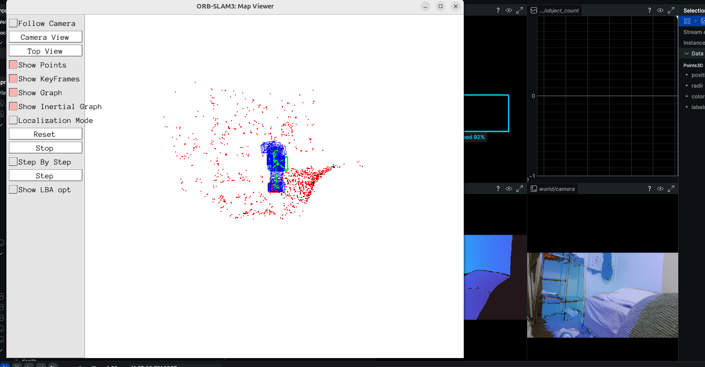
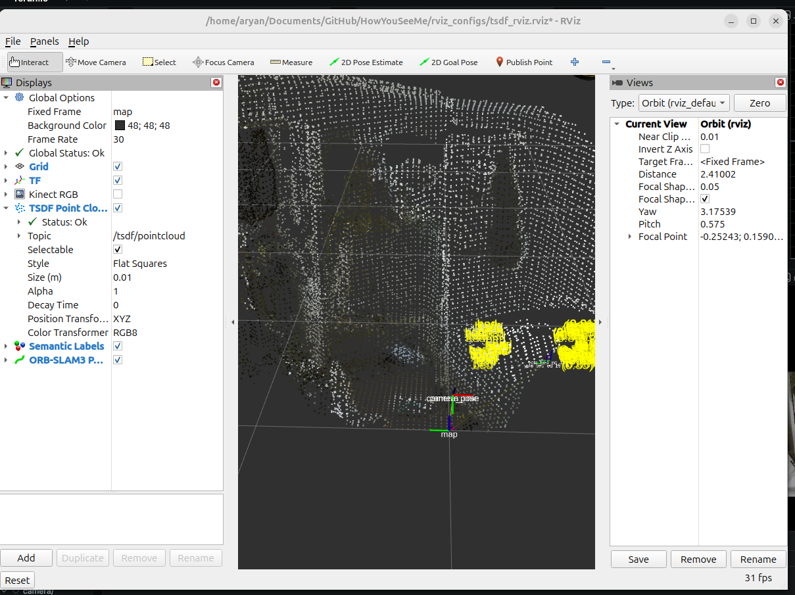
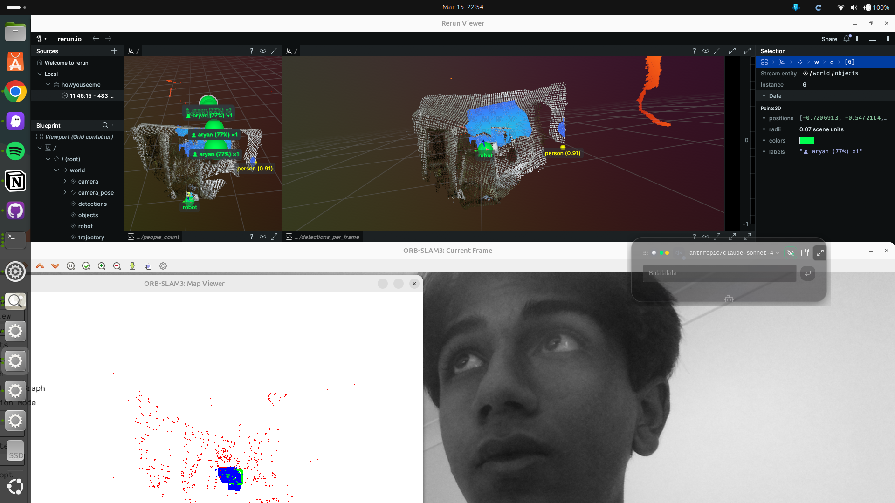
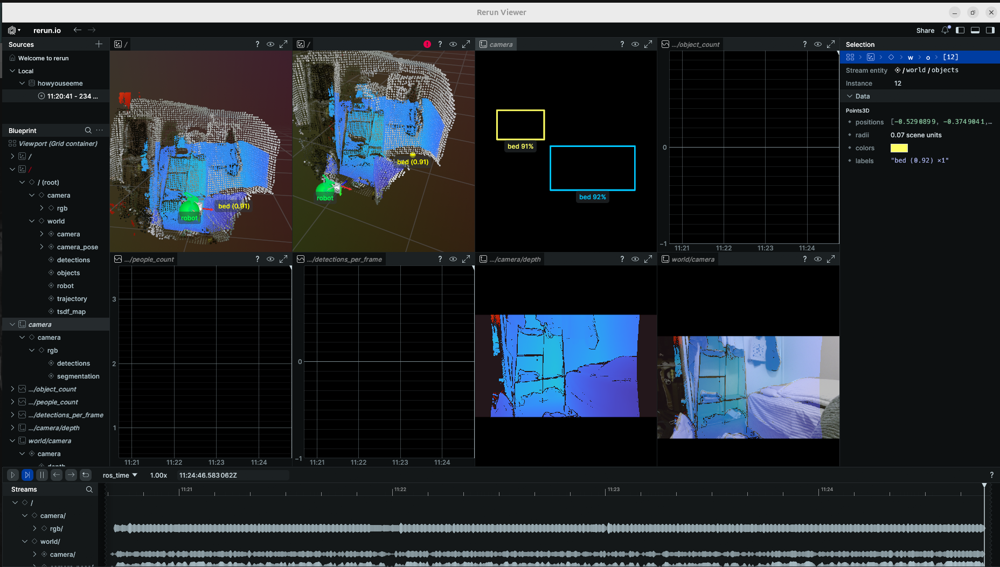
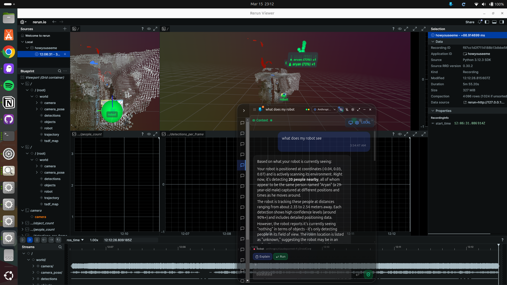

# HowYouSeeMe

> **A robot that knows where everything is.**

[](LICENSE)
[](https://docs.ros.org/en/jazzy/)
[](docs/Kinect2_ROS2_Bridge_Setup.md)
[](https://developer.nvidia.com/cuda-toolkit)
[](docs/CV_PIPELINE_V2_GUIDE.md)

---

## The problem

LLMs can reason about the world, but they're blind to it.

You can ask GPT-4 where your keys probably are based on habit. You can ask Claude to help you find your 3D printer. But neither of them can look around the room, remember that the printer was last seen in the hallway three hours ago, notice it's moved, and navigate to it — because they have no persistent, grounded, spatial awareness of the physical world they're supposed to be helping you with.

The gap between "AI that talks about the world" and "AI that actually perceives the world" is a solved problem in robotics research. It just hasn't been assembled into something open, deployable, and LLM-native.

HowYouSeeMe is that assembly.

---

## What it does

A Kinect v2 and a BlueLily IMU feed a continuous perception loop. ORB-SLAM3 tracks the camera pose and builds a 3D map in real time. YOLO11 identifies everything in frame and back-projects each detection into the SLAM coordinate space — so every object gets a 3D world position, not just a pixel bounding box.

That spatial knowledge accumulates. Objects get tracked across frames. When something significant happens — a person walks in, a known object moves, a new object appears — the system saves a checkpoint: the RGB frame, depth map, pose, and detections, atomically written to disk. Async workers then enrich each checkpoint with SAM2 masks, InsightFace identity, and emotion estimates, without ever blocking the live perception loop.

The result is `world_state.json` — a continuously updated document describing every object the robot has ever seen, where it is in 3D space, when it was last confirmed, and anything the system has learned about it. Any LLM can query this via MCP.
```
"where is the soldering iron?"
→ /tmp/world_state.json → last seen at [2.4, 0.8, 0.9] → 4 minutes ago → confidence 0.91
```

When the robot sleeps, OpenSplat runs on the accumulated keyframes and produces a photorealistic Gaussian splat of the environment — the map gets better every night without any active effort.

---

## Screenshots

| ORB-SLAM3 live tracking | RViz semantic map |
|---|---|
|  |  |

| Person detection + face recognition | Object detection (bedroom) |
|---|---|
|  |  |

| Ally Robot Mode — spatial AI assistant |
|---|
|  |

---

## Spatial perception for AI

Most AI systems treat space as flat. An image is a grid of pixels. A document is a sequence of tokens. There's no inherent sense of *where* things are relative to each other in 3D, no memory of where something was yesterday, no ability to say "the cup is on the table to the left of the laptop, about 80cm away."

HowYouSeeMe gives an LLM a grounded 3D world model it can query like a database:
```
LLM: "Is there anyone in the room?"
→ query_world() → people: [{position: [1.2, 0.3, 0.0], identity: "unknown", emotion: "neutral"}]
→ "Yes, one person, about 1.2 metres ahead, appears neutral."

LLM: "Go find the 3D printer"
→ navigate_to("3D printer")
→ not in world_state → visual search mode
→ LLM generates description → robot sweeps room → YOLO+CLIP locks on → pathplans precisely
→ saves named memory → next time: direct navigation in <15 seconds

LLM: "Remember where I left my keys"
→ remember_object("keys")
→ YOLO watches for keys class → locks 3D position on next detection
→ survives reboots → queryable forever
```

The MCP server is what makes this composable. Any LLM — Claude, GPT-4, a local Ollama model, Ally's voice interface — can call these tools and get grounded spatial answers. The robot becomes a spatial memory system that any AI can plug into.

---

## Architecture

### The 5 tiers
```
┌─────────────────────────────────────────────────────────┐
│  TIER 1 — always on                                     │
│  ORB-SLAM3 · YOLO11 · Event checkpointer               │
│  ~1GB VRAM · 3-4 CPU cores · never killed              │
├─────────────────────────────────────────────────────────┤
│  TIER 2 — event-driven                                  │
│  SAM2 · InsightFace · FER · Async frame analyser       │
│  spawned on trigger · killed when idle                  │
├─────────────────────────────────────────────────────────┤
│  TIER 3 — world synthesis                               │
│  World synthesiser · Named memory store                 │
│  merges all perception → world_state.json every 3s     │
├─────────────────────────────────────────────────────────┤
│  TIER 4 — persistence                                   │
│  /tmp/stm/checkpoints · world_state.json               │
│  ~/howyouseeme_persistent/named_memories.json           │
├─────────────────────────────────────────────────────────┤
│  TIER 5 — interface                                     │
│  MCP server :8090 · RViz · Rerun · Ally Robot Mode     │
└─────────────────────────────────────────────────────────┘
```

**Why tiers?** Your GPU has 4GB. Running SAM2, InsightFace, FER, YOLO, and SLAM simultaneously would exceed that. The tier system means at idle you're using ~1GB. A person walks in — InsightFace and FER spin up for that event, enrich the checkpoint asynchronously, then die. Peak usage never exceeds ~1.43GB VRAM.

### Navigation `[PLANNED/WIP]`
```
Natural language goal
        ↓
Semantic goal resolver
  ├─ named memory?    → direct 3D coordinate → RRT* → DWA → /cmd_vel
  ├─ seen recently?   → last known position  → RRT* → DWA → /cmd_vel
  ├─ room name?       → SLAM map centroid    → RRT* → DWA → /cmd_vel
  └─ never seen?      → visual search mode
                            ↓
                      LLM generates description
                      + optional web reference image
                            ↓
                      room sweep: rotate → expand spiral
                      score: YOLO conf × CLIP similarity
                            ↓
                      detection → back-project → save memory → pathplan
```

### Sleep-time map enhancement `[PLANNED]`
```
Robot active  →  keyframes saved to disk continuously
Robot sleeps  →  OpenSplat runs on accumulated frames (15-25 min on RTX 3050)
Robot wakes   →  photorealistic .ply splat loaded as /splat/background
                 YOLO semantic labels float on top of photorealistic map
                 map quality improves every night automatically
```

---

## AI models

| Model | Purpose | Tier | VRAM | When |
|---|---|---|---|---|
| YOLO11 | Object detection | 1 | ~400MB | Always |
| SAM2 tiny | Precise segmentation | 2 | ~280MB | On event |
| InsightFace | Face identification | 2 | ~200MB | Person detected |
| FER (hsemotion) | Emotion detection | 2 | ~150MB | Person detected |
| FastSAM | Fast segmentation | 2 | ~200MB | On demand |
| CLIP | Visual search matching | nav | ~200MB | Visual search |
| TensorRT | YOLO acceleration | opt | — | If exported |

**Peak (all active): ~1.43GB VRAM.** Fits on 4GB with headroom for the OS.

---

## MCP tools

The robot's world knowledge as a callable API. Any LLM connects to `http://localhost:8090/mcp`.

| Tool | What it does |
|---|---|
| `query_world` | Full world state — objects, people, recent events |
| `where_is(label)` | Last known 3D position of anything |
| `remember_object(name, label)` | Pin an object for persistent tracking |
| `recall_memory(name)` | Get a pinned object's confirmed location |
| `forget_memory(name)` | Stop tracking |
| `get_recent_events` | Last N perception events with timestamps |
| `get_checkpoint(id)` | Retrieve a specific past checkpoint frame and analysis |
| `get_camera_frame` | Latest RGB frame as base64 JPEG for vision LLMs |
| `get_robot_status` | Natural language status summary |
| `get_robot_context` | System prompt context block for Ally Robot Mode |
| `navigate_to(query)` | Pathfind to anything in natural language `[PLANNED]` |
| `navigate_to_pose` | Pathfind to exact 3D coordinates `[PLANNED]` |
| `cancel_navigation` | Stop immediately `[PLANNED]` |
| `navigation_status` | Current nav state, goal, ETA `[PLANNED]` |

---

## Ally integration

[Ally](https://github.com/AryanRai/Ally) is the voice and chat interface. In Robot Mode it connects to HowYouSeeMe's MCP server and becomes a spatial AI assistant with grounded world knowledge.
```
"What can you see right now?"
→ query_world → objects with 3D positions → natural language description

"Go find the 3D printer"
→ navigate_to("3D printer") → visual search → pathplan → arrive → confirm

"Remember where the apple is"
→ remember_object → YOLO watches → pins on next detection → survives reboot

"Show me what you see"
→ get_camera_frame → base64 JPEG → vision LLM describes the scene
```

Enabling Robot Mode in Ally automatically fetches `get_robot_status` and injects it as system context — so the LLM always knows the robot's current state before the first message.

---

## Key topics

| Topic | Type | Hz |
|---|---|---|
| `/kinect2/hd/image_color` | Image | 14.5 |
| `/kinect2/hd/image_depth_rect` | Image | 14.5 |
| `/imu/data` | Imu | 800 |
| `/orb_slam3/pose` | PoseStamped | 14.5 |
| `/tsdf/pointcloud` | PointCloud2 | 1 |
| `/splat/background` | PointCloud2 | 0.1 |
| `/cv_pipeline/results` | String JSON | 14.5 |
| `/cv_pipeline/enriched` | String JSON | 14.5 |
| `/semantic/markers` | MarkerArray | 0.3 |
| `/semantic/world_state` | String JSON | 0.3 |
| `/memory/checkpoint_saved` | String | event |
| `/navigation/path` | Path | event |
| `/cmd_vel` | Twist | 10 |

---

## Implementation status

| Feature | Status | Notes |
|---|---|---|
| Kinect v2 ROS 2 bridge | ✅ done | CUDA-accelerated, 14.5fps |
| BlueLily IMU bridge | ✅ done | 800Hz, /imu/data |
| ORB-SLAM3 RGB-D | ✅ done | Visual-only, IMU fusion pending calibration |
| YOLO11 detection | ✅ done | cv_pipeline, streaming |
| SAM2 / FastSAM / InsightFace / FER | ✅ done | On-demand workers |
| Open3D TSDF integrator | ✅ done | 1Hz CPU map update |
| Semantic projection node | ✅ done | 3D labels in RViz |
| Event checkpointer | ✅ done | Checkpoint save + enrichment pipeline |
| Async frame analyser | ✅ done | Non-blocking enrichment worker |
| Live enrichment node | ✅ done | Real-time face/pose/seg on /cv_pipeline/enriched |
| World synthesiser | ✅ done | Runs every 3s, outputs world_state.json |
| Named memory store | ✅ done | Persistent across reboots |
| MCP server | ✅ done | Port 8090, streamable-http, 10 tools live |
| Rerun visualisation | ✅ done | rerun_bridge_node, depth+TSDF+pose+enrichment |
| Ally Robot Mode integration | ✅ done | MCP session handshake, agentic tool loop |
| IMU-camera calibration (Kalibr) | 🔧 WIP | Identity transform placeholder for now |
| Navigation stack (RRT* + DWA) | 📋 planned | Fully designed |
| Visual search (YOLO + CLIP) | 📋 planned | Designed |
| Sleep-time Gaussian splat | 📋 planned | Designed, needs Orin for full speed |
| Isaac ROS migration (cuVSLAM + NVBLOX) | 📋 planned | Pending AGX Orin hardware |

---

## Compute targets

| Platform | Status | Notes |
|---|---|---|
| RTX 3050 laptop, Ubuntu 24.04 | ✅ current | 4GB VRAM ceiling, dev platform |
| Jetson AGX Orin 64GB | 📋 planned | 64GB unified memory, target robot platform |
| Isaac ROS (cuVSLAM + NVBLOX) | 📋 planned | Replaces ORB-SLAM3 + TSDF, same codebase |

---

## Quick start

```bash
# Dependencies (system Python 3.12, ROS2 Jazzy)
sudo apt install ros-jazzy-desktop ros-jazzy-cv-bridge
pip install open3d ultralytics rerun-sdk --user

# Build
cd ros2_ws && colcon build && source install/setup.bash

# Launch everything
./scripts/run_complete_slam_system.sh

# Visualisation (separate terminal)
rerun   # Rerun opens automatically via rerun_bridge_node
# or RViz:
rviz2
```

### Interactive CV model menu
```bash
./scripts/cv_pipeline_menu.sh
```
```
CV Pipeline — Model Selection

  1) SAM2          segment anything
  2) FastSAM       fast segmentation with text prompts
  3) YOLO11        detection, pose, segmentation, OBB
  4) InsightFace   face recognition + liveness
  5) FER           emotion detection (7 emotions)

  8) List available models
  9) Stop active streaming
```

---

## Repo structure
```
HowYouSeeMe/
├── ros2_ws/src/
│   ├── kinect2_ros2_cuda/            Kinect v2 bridge — do not modify
│   ├── bluelily_bridge/              IMU serial bridge
│   │   └── src/bluelily_imu_node.cpp
│   ├── cv_pipeline/                  AI model nodes (C++ pipeline + Python workers)
│   │   ├── src/cv_pipeline_node.cpp
│   │   └── python/
│   │       ├── cv_model_manager.py
│   │       ├── sam2_server_v2.py
│   │       ├── sam2_worker.py
│   │       └── insightface_worker.py
│   └── kinect2_slam/                 SLAM, memory, MCP, visualisation
│       ├── kinect2_slam/
│       │   ├── tsdf_integrator_node.py
│       │   ├── event_checkpointer_node.py
│       │   ├── async_analyser_node.py
│       │   ├── live_enrichment_node.py
│       │   ├── world_synthesiser_node.py
│       │   ├── named_memory_node.py
│       │   ├── rerun_bridge_node.py
│       │   └── mcp_server.py         ← MCP on :8090
│       └── launch/
│           └── howyouseeme_memory.launch.py
├── scripts/
│   ├── run_complete_slam_system.sh   ← main launch script
│   ├── run_phase2_3.sh               ORB-SLAM3 + TSDF
│   └── cv_pipeline_menu.sh           interactive model selector
├── integration/
│   └── Ally/glass-pip-chat/          Ally desktop overlay + Robot Mode
├── data/faces/                       InsightFace database
├── orb_slam3_configs/                ORB-SLAM3 YAML configs
├── kalibr_configs/                   IMU-camera calibration
└── docs/                             guides and references
```

---

## Research context

This project draws on several lines of robotics and vision research:

**ConceptFusion (2023)** — language-embedded 3D maps where every point carries a CLIP embedding, enabling natural language spatial queries. Directly relevant to the world synthesiser and semantic projection nodes.

**SayPlan (2023)** — LLM task planning using a 3D scene graph as structured context. `world_state.json` is a simplified scene graph serving exactly this purpose.

**HomeRobot (Meta, 2023)** — open-vocabulary mobile manipulation: find and interact with any object described in natural language. The visual search mode implements a version of this.

**OpenScene / LERF** — queryable neural scene representations where the map itself becomes searchable by language. The sleep-time splat pipeline points toward this direction.

The specific combination — modular on-demand model loading, sleep-time Gaussian splat densification, MCP as the LLM-robot interface standard, and persistent named spatial memory — does not exist as an integrated open system elsewhere. That's the contribution.

---

## Related projects

- **[Ally](https://github.com/AryanRai/Ally)** — glassmorphic desktop AI overlay, Robot Mode connects to HowYouSeeMe via MCP
- **DroidCore** — full robot control stack that HowYouSeeMe feeds into

---

## Hardware

| Component | Part | Interface |
|---|---|---|
| RGB-D camera | Microsoft Kinect v2 | USB 3.0 |
| IMU | BlueLily (MPU6500) | /dev/ttyACM0 115200 baud |
| Compute (dev) | RTX 3050 laptop, Ubuntu 24.04 | CUDA 12.x |
| Compute (robot) | Jetson AGX Orin 64GB `[planned]` | JetPack 6 |

The robot head is a 3D-printed enclosure mounting the Kinect v2 front-facing, BlueLily IMU internally, and compute on top. See [Robot Head Setup](docs/ROBOT_HEAD_SETUP.md).

---

## Contact

- GitHub: [@AryanRai](https://github.com/AryanRai)
- Email: buzzaryanrai@gmail.com
- Issues: [GitHub Issues](https://github.com/AryanRai/HowYouSeeMe/issues)
