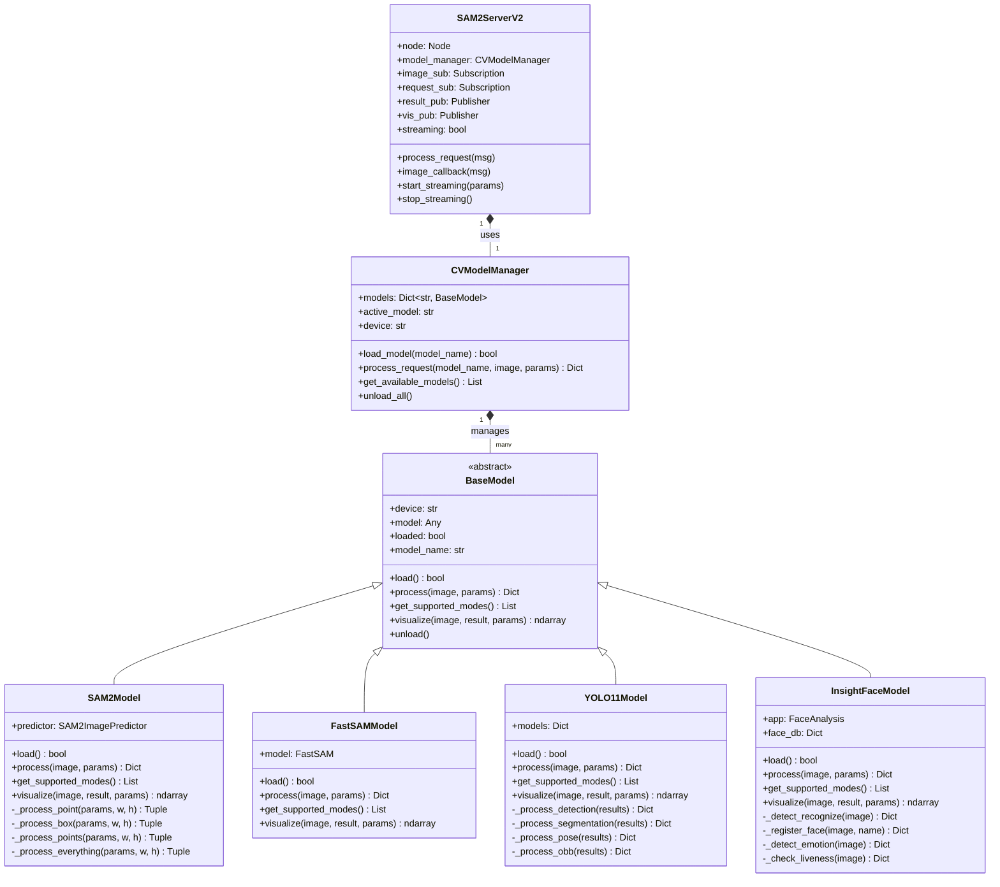

# HowYouSeeMe - Advanced ROS2 Computer Vision System

> **A production-ready ROS2 computer vision system featuring Kinect v2, RTABMap SLAM, and 5 AI models for real-time perception, segmentation, detection, face recognition, and emotion analysis.**

[](LICENSE)
[](https://docs.ros.org/en/humble/)
[](docs/Kinect2_ROS2_Bridge_Setup.md)
[](https://developer.nvidia.com/cuda-toolkit)
[](docs/CV_PIPELINE_V2_GUIDE.md)

## 🎯 Overview

HowYouSeeMe is a **complete computer vision system** built on ROS2 Humble, providing real-time 3D perception, object detection, segmentation, face recognition, and emotion analysis. The system integrates multiple state-of-the-art AI models with Kinect v2 RGB-D sensing and RTABMap SLAM for comprehensive spatial understanding.


### 🌍 Vision: World State Perception System

HowYouSeeMe is the **perception foundation** for an intelligent robotics ecosystem that combines:
- **Computer Vision Models**: YOLO, SAM, Segmentation, VLMs
- **SLAM & Mapping**: RTABMap for 3D spatial understanding
- **IMU Fusion**: BlueLily integration for enhanced localization
- **World State Summarizer**: Unified interface combining all active models
- **MCP Server**: Model Context Protocol for LLM integration
- **Visual Memory System**: Persistent object tracking and spatial memory

The goal is to create a **unified world state** that any LLM can query to understand the robot's environment, remember object locations, and make informed decisions based on real-time perception.

## ✨ Key Features

### 🤖 **5 AI Models - Unified Pipeline**
1. **SAM2 (Segment Anything Model 2)** - Real-time segmentation
   - Point, box, and everything modes
   - Streaming support up to 30 FPS
   - Optimized for 4GB GPUs (0.28GB VRAM)

2. **FastSAM** - Fast segmentation with text prompts
   - Natural language descriptions
   - Multiple prompt types (point, box, text)
   - Real-time performance

3. **YOLO11** - Multi-task detection
   - Object detection
   - Instance segmentation
   - Pose estimation
   - Oriented bounding boxes (OBB)

4. **InsightFace** - Face recognition & liveness
   - Face detection and recognition
   - Face database management
   - Liveness detection (anti-spoofing)
   - Age and gender estimation

5. **Emotion Detection (FER)** - 7 emotions
   - Happy, Sad, Angry, Surprise, Fear, Disgust, Neutral
   - Real-time streaming
   - Multi-face support
   - Color-coded visualization

### 🎮 **Interactive Menu System**
```bash
./cv_menu.sh  # Launch interactive menu
```

```
CV Pipeline - Model Selection
========================================

Select a Model:

  1) 🎯 SAM2 - Segment Anything Model 2
  2) ⚡ FastSAM - Faster SAM with Text Prompts
  3) 🔍 YOLO11 - Detection, Pose, Segmentation, OBB
  4) 👤 InsightFace - Face Recognition & Liveness
  5) 😊 Emotion Detection - 7 Emotions (FER)
  6) 📊 [Future] Depth Anything
  7) 🧠 [Future] DINO Features

System Commands:
  8) 📋 List Available Models
  9) 🛑 Stop Active Streaming
```

### 🗺️ **RTABMap SLAM Integration**
- Real-time 3D mapping and localization
- Loop closure detection
- RGB-D odometry
- Point cloud generation
- TF2 coordinate transforms

### 📡 **Kinect v2 Bridge**
- 14.5 FPS RGB-D streaming
- Multiple resolutions (HD, QHD, SD)
- CUDA-accelerated processing
- 30+ ROS2 topics
- Calibrated depth and color alignment

## 🏗️ System Architecture

### UML Class Diagram



### ROS2 Node Graph

```mermaid
flowchart TB
    subgraph Hardware["🔌 Hardware Layer"]
        KINECT[("Kinect v2\nRGB-D Sensor")]
        IMU[("BlueLily\n9-axis IMU")]
    end
    
    subgraph ROS2["🤖 ROS2 Nodes"]
        subgraph Drivers["Driver Nodes"]
            KB[kinect2_bridge_node]
            BB[bluelily_imu_node]
        end
        
        subgraph SLAM["SLAM Nodes"]
            RTAB[rtabmap_node]
            ODOM[rgbd_odometry_node]
        end
        
        subgraph CV["CV Pipeline"]
            CVS[sam2_server_v2]
            subgraph Workers["Model Workers"]
                SAM2W[SAM2Worker]
                FASTW[FastSAMWorker]
                YOLOW[YOLO11Worker]
                INSW[InsightFaceWorker]
            end
        end
    end
    
    subgraph Topics["📡 ROS2 Topics"]
        direction LR
        RGB[/kinect2/hd/image_color]
        DEPTH[/kinect2/hd/image_depth_rect]
        POINTS[/kinect2/hd/points]
        IMUD[/bluelily/imu/data]
        REQ[/cv_pipeline/model_request]
        RES[/cv_pipeline/results]
        VIS[/cv_pipeline/visualization]
        MAP[/rtabmap/map]
        ODOMTOPIC[/rtabmap/odom]
    end
    
    subgraph TF["🔄 TF2 Frames"]
        direction LR
        WORLD[world]
        BASE[base_link]
        CAMERA[kinect2_link]
        OPTICAL[kinect2_rgb_optical_frame]
    end
    
    KINECT --> KB
    IMU --> BB
    
    KB --> RGB
    KB --> DEPTH
    KB --> POINTS
    BB --> IMUD
    
    RGB --> CVS
    RGB --> RTAB
    DEPTH --> RTAB
    DEPTH --> ODOM
    IMUD --> RTAB
    
    REQ --> CVS
    CVS --> RES
    CVS --> VIS
    
    CVS --> SAM2W
    CVS --> FASTW
    CVS --> YOLOW
    CVS --> INSW
    
    ODOM --> ODOMTOPIC
    RTAB --> MAP
    
    WORLD --> BASE
    BASE --> CAMERA
    CAMERA --> OPTICAL
```

### Data Flow Diagram


### Package Structure


## � QuCick Start

### Prerequisites
```bash
# System Requirements
- Ubuntu 22.04 LTS
- ROS2 Humble
- NVIDIA GPU with CUDA 12.6+
- Microsoft Kinect v2
- 8GB+ RAM
- Anaconda/Miniconda
```

### Installation

1. **Clone Repository**
```bash
git clone https://github.com/AryanRai/HowYouSeeMe.git
cd HowYouSeeMe
```

2. **Install Dependencies**
```bash
# Install Kinect v2 drivers
./install_kinect_drivers.sh

# Install ROS2 packages
cd ros2_ws
colcon build
source install/setup.bash

# Install AI models (in conda environment)
conda activate howyouseeme
./install_sam2.sh
./install_fastsam.sh
./install_yolo11.sh
./install_insightface.sh
```

3. **Launch System**
```bash
# Full system (Kinect + SLAM + CV Pipeline + RViz)
./launch_full_system_rviz.sh

# Or just Kinect + CV Pipeline
./launch_kinect_sam2_server.sh
```

4. **Use Interactive Menu**
```bash
./cv_menu.sh
```

## 📖 Documentation

### Quick Start Guides
- [Getting Started](docs/Getting_Started.md) - First-time setup
- [Quick Start CV Pipeline](docs/QUICK_START_CV_PIPELINE.md) - CV system basics
- [CV Pipeline V2 Guide](docs/CV_PIPELINE_V2_GUIDE.md) - Complete pipeline documentation

### Hardware Setup
- [Kinect v2 ROS2 Bridge](docs/Kinect2_ROS2_Bridge_Setup.md) - Sensor setup and calibration
- [Kinect v2 ROS Humble](docs/KinectV2RosHumble.md) - ROS2 integration details

### SLAM & Navigation
- [SLAM Quick Reference](docs/SLAM_QUICK_REFERENCE.md) - RTABMap commands
- [SLAM Integration](docs/Kinect_SLAM_Integration.md) - Full SLAM setup
- [SLAM Performance](docs/SLAM_Performance_Optimization.md) - Optimization tips

### AI Models
- [SAM2 Integration](docs/SAM2_SUCCESS.md) - Segmentation model
- [FastSAM Guide](docs/fastsam.md) - Fast segmentation
- [YOLO11 Integration](docs/YOLO11_INTEGRATION.md) - Detection and pose
- [InsightFace Complete](docs/INSIGHTFACE_COMPLETE_SUMMARY.md) - Face recognition
- [Emotion Detection](docs/EMOTION_DETECTION_COMPLETE.md) - Emotion analysis

### System Guides
- [Menu Guide](docs/MENU_GUIDE.md) - Interactive menu usage
- [Streaming Guide](docs/STREAMING_FIX.md) - Continuous streaming
- [Troubleshooting](docs/CV_PIPELINE_TROUBLESHOOTING.md) - Common issues
- [RViz Visualization](docs/RVIZ_VISUALIZATION_GUIDE.md) - Visualization setup

## 🎯 Usage Examples

### 1. SAM2 Segmentation
```bash
# Point mode - segment object at coordinates
ros2 topic pub --once /cv_pipeline/model_request std_msgs/msg/String \
    "data: 'sam2:prompt_type=point,x=480,y=270'"

# Box mode - segment region
ros2 topic pub --once /cv_pipeline/model_request std_msgs/msg/String \
    "data: 'sam2:prompt_type=box,box=200,150,700,450'"

# Everything mode - segment all objects
ros2 topic pub --once /cv_pipeline/model_request std_msgs/msg/String \
    "data: 'sam2:prompt_type=everything'"

# Streaming mode
ros2 topic pub --once /cv_pipeline/model_request std_msgs/msg/String \
    "data: 'sam2:prompt_type=point,x=480,y=270,stream=true,duration=30,fps=5'"
```

### 2. YOLO11 Detection
```bash
# Object detection
ros2 topic pub --once /cv_pipeline/model_request std_msgs/msg/String \
    "data: 'yolo11:task=detect,conf=0.25'"

# Pose estimation
ros2 topic pub --once /cv_pipeline/model_request std_msgs/msg/String \
    "data: 'yolo11:task=pose,conf=0.25'"

# Instance segmentation
ros2 topic pub --once /cv_pipeline/model_request std_msgs/msg/String \
    "data: 'yolo11:task=segment,conf=0.25'"
```

### 3. Face Recognition
```bash
# Detect and recognize faces
ros2 topic pub --once /cv_pipeline/model_request std_msgs/msg/String \
    "data: 'insightface:mode=detect_recognize'"

# Register new person
ros2 topic pub --once /cv_pipeline/model_request std_msgs/msg/String \
    "data: 'insightface:mode=register,name=John_Doe'"

# Check liveness (anti-spoofing)
ros2 topic pub --once /cv_pipeline/model_request std_msgs/msg/String \
    "data: 'insightface:mode=liveness'"
```

### 4. Emotion Detection
```bash
# Single frame emotion detection
ros2 topic pub --once /cv_pipeline/model_request std_msgs/msg/String \
    "data: 'insightface:mode=emotion'"

# Stream emotions continuously
ros2 topic pub --once /cv_pipeline/model_request std_msgs/msg/String \
    "data: 'insightface:mode=emotion,stream=true,duration=30,fps=5'"
```

### 5. FastSAM with Text
```bash
# Segment using text description
ros2 topic pub --once /cv_pipeline/model_request std_msgs/msg/String \
    "data: 'fastsam:prompt_type=text,text=a photo of a dog'"
```

## 🔧 System Commands

### Launch Scripts
```bash
# Full system with visualization
./launch_full_system_rviz.sh

# Kinect + CV Pipeline only
./launch_kinect_sam2_server.sh

# SLAM with IMU
./launch_kinect2_slam_with_imu.sh
```

### Utility Scripts
```bash
# Interactive menu
./cv_menu.sh

# Stop all processes
./kill_all.sh

# Stop streaming
./stop_cv_streaming.sh

# Test emotion detection
./test_emotion_detection.sh
```

### Monitoring
```bash
# View results
ros2 topic echo /cv_pipeline/results

# Watch visualization
# In RViz: Add Image display for /cv_pipeline/visualization

# Monitor performance
ros2 topic hz /cv_pipeline/results
```

## 📊 Performance

### Processing Times
- **SAM2 Tiny**: ~0.7s per frame (0.28GB VRAM)
- **YOLO11**: ~0.1-0.3s per frame
- **InsightFace**: ~0.3-0.5s per frame
- **Emotion Detection**: ~0.5s per frame
- **FastSAM**: ~0.2-0.4s per frame

### Streaming Performance
- **Recommended FPS**: 2-5 for AI models
- **Kinect FPS**: 14.5 (RGB-D)
- **SLAM Update Rate**: 1 Hz
- **GPU Memory**: 0.28-2GB depending on model

### System Resources
- **RAM Usage**: 4-8GB
- **GPU Memory**: 2-4GB (with all models loaded)
- **CPU Usage**: 30-50% (4 cores)

## 🛠️ Development

### Project Structure
```
HowYouSeeMe/
├── ros2_ws/                    # ROS2 workspace
│   └── src/
│       ├── cv_pipeline/        # CV Pipeline package
│       │   └── python/         # AI model workers
│       ├── kinect2_ros2_cuda/  # Kinect bridge
│       └── bluelily_bridge/    # IMU integration
├── docs/                       # Documentation
├── BlueLily/                   # IMU firmware
├── scripts/                    # Utility scripts
├── launch_*.sh                 # Launch scripts
├── cv_menu.sh                  # Interactive menu
└── README.md                   # This file
```

### Adding New Models
See [ADD_NEW_MODEL_GUIDE.md](ros2_ws/src/cv_pipeline/python/ADD_NEW_MODEL_GUIDE.md) for instructions on integrating new AI models.

### Key Components
- **cv_model_manager.py**: Model loading and management
- **sam2_server_v2.py**: Main CV pipeline server
- **sam2_worker.py**: SAM2 model worker
- **yolo11_worker.py**: YOLO11 model worker
- **insightface_worker.py**: Face recognition and emotion detection
- **fastsam_worker.py**: FastSAM model worker

## 🎓 Features in Detail

### Streaming Support
All models support continuous streaming:
- **Duration**: Set in seconds or -1 for continuous
- **FPS**: Configurable 1-30 FPS
- **Stop Command**: Instant stop without restart
- **Model Switching**: Switch between models during streaming

### Visualization
- **RViz Integration**: Real-time visualization
- **Color-Coded Results**: Different colors for different detections
- **Bounding Boxes**: Object and face detection
- **Segmentation Masks**: Transparent overlays
- **Emotion Colors**: Color-coded emotions
- **Pose Keypoints**: Human skeleton visualization

### Face Database
- **Persistent Storage**: Face embeddings saved to disk
- **Multiple Samples**: Register multiple images per person
- **Metadata Tracking**: Names, timestamps, encounter counts
- **Similarity Threshold**: Configurable recognition threshold

### SLAM Features
- **3D Mapping**: Real-time point cloud generation
- **Loop Closure**: Automatic map correction
- **Odometry**: Visual-inertial odometry
- **Localization**: 6-DOF pose estimation
- **Map Saving**: Persistent map storage

## 🐛 Troubleshooting

### Common Issues

**Server not starting?**
```bash
# Check if processes are running
ps aux | grep sam2_server

# Kill existing processes
./kill_all.sh

# Restart
./launch_kinect_sam2_server.sh
```

**Models not loading?**
```bash
# Activate conda environment
conda activate howyouseeme

# Reinstall models
./install_sam2.sh
./install_insightface.sh
```

**Kinect not detected?**
```bash
# Check USB connection
lsusb | grep Xbox

# Restart udev rules
sudo udevadm control --reload-rules
sudo udevadm trigger
```

**CUDA errors?**
```bash
# Check CUDA installation
nvidia-smi

# Verify CUDA version
nvcc --version
```

See [CV_PIPELINE_TROUBLESHOOTING.md](docs/CV_PIPELINE_TROUBLESHOOTING.md) for more solutions.

## 🔮 Roadmap

### ✅ Completed (Current Status)
- [x] Kinect v2 ROS2 bridge with CUDA
- [x] RTABMap SLAM integration
- [x] SAM2 segmentation (Meta SAM2)
- [x] FastSAM with text prompts
- [x] YOLO11 multi-task detection
- [x] InsightFace face recognition
- [x] Emotion detection (7 emotions via FER)
- [x] Interactive menu system
- [x] Streaming support for all models
- [x] RViz visualization
- [x] BlueLily IMU integration code
- [x] Coordinate frame fixes

### 🚧 Short Term (In Progress)
- [ ] **Fix SLAM and Kinect driver** - Stability improvements
- [ ] **Test BlueLily integration** - IMU fusion validation
- [ ] **IMU fusion with SLAM** - Better localization, lower drift
- [ ] **Hand gesture detection** - MediaPipe or custom model
- [ ] **MCP Server** - Model Context Protocol for LLM integration
- [ ] **Depth + Segmentation fusion** - Combine depth with masks
- [ ] **3D world position estimation** - Mark YOLO objects on SLAM map
- [ ] **Gaze detection** - Eye tracking integration
- [ ] **OCR tool** - Text detection and recognition

### 🎯 Medium Term
- [ ] **World State Summarizer** - Unified interface combining all models
- [ ] **Visual Memory System** - Remember object locations on SLAM map
- [ ] **Event-based checkpointing** - Save frames when humans/objects detected
- [ ] **Async processing** - Process past frames in background
- [ ] **Object highlighting** - Highlight objects/rooms when discussing
- [ ] **Meta SAM3** - Upgrade to latest segmentation model
- [ ] **Depth Anything** - Advanced depth estimation
- [ ] **DINO features** - Self-supervised feature extraction

### 🔮 Long Term Vision
- [ ] **Fix Kinect CUDA bridge** - Full GPU acceleration
- [ ] **Extensible model pipeline** - Custom sequential model chains
- [ ] **Condition-based pipelines** - Dynamic model activation
- [ ] **Gaussian splatting** - 3D scene reconstruction
- [ ] **NVBLOX integration** - Real-time 3D mapping
- [ ] **LightGlue ONNX** - Feature matching
- [ ] **Multi-camera support** - Sensor fusion
- [ ] **Web interface** - Remote monitoring
- [ ] **Mobile app** - Control and visualization

### 🧠 Intelligent Features
- [ ] **On-demand model loading** - Only run required models
- [ ] **Always-on SLAM** - Continuous mapping
- [ ] **Selective object detection** - Run YOLO when needed
- [ ] **LLM-driven activation** - Models triggered by natural language
- [ ] **Spatial memory queries** - "Where did I see the apple?"
- [ ] **Object persistence** - Track objects across frames
- [ ] **Scene understanding** - Semantic room mapping

## 🤝 Contributing

Contributions are welcome! Please:

1. Fork the repository
2. Create a feature branch
3. Make your changes
4. Add tests and documentation
5. Submit a pull request

### Development Guidelines
- Follow PEP 8 for Python code
- Add docstrings to all functions
- Update documentation for new features
- Test with real Kinect hardware
- Ensure ROS2 compatibility

## 📄 License

MIT License - see [LICENSE](LICENSE) file for details.

## 🏗️ System Integration

### BlueLily IMU Integration
HowYouSeeMe integrates with **BlueLily**, a high-performance flight computer and sensing platform:
- **9-axis IMU** (MPU6500) for enhanced SLAM localization
- **Real-time sensor fusion** with Kinect RGB-D data
- **Reduced drift** in SLAM through IMU corrections
- **ROS2 bridge** for seamless data integration

See [BlueLily Integration Guide](docs/BlueLily_ROS2_Integration.md) for details.

### Architecture Philosophy
1. **On-Demand Processing**: Models load only when needed to conserve resources
2. **Always-On SLAM**: Continuous mapping for spatial awareness
3. **Selective Detection**: YOLO runs based on context and requirements
4. **LLM Integration**: Natural language control via MCP server
5. **Visual Memory**: Persistent object tracking on SLAM map
6. **Event-Driven**: Checkpoint frames when significant events occur

### Future Ecosystem
- **DroidCore**: Central robotics platform
- **Ally**: LLM-based cognitive system
- **Comms**: Multi-protocol communication layer
- **World State API**: Unified perception interface

## 🙏 Acknowledgments

- **Meta AI** - SAM2 model
- **Ultralytics** - YOLO11 and FastSAM
- **InsightFace** - Face recognition models
- **FER** - Emotion detection
- **RTABMap** - SLAM implementation
- **ROS2 Community** - Robotics framework
- **NVIDIA** - CUDA acceleration and NVBLOX

## 📧 Contact

- **Email**: buzzaryanrai@gmail.com
- **GitHub**: [@AryanRai](https://github.com/AryanRai)
- **Issues**: [GitHub Issues](https://github.com/AryanRai/HowYouSeeMe/issues)

## 🌟 Star History

If you find this project useful, please consider giving it a star! ⭐

---

**Built with ❤️ for advanced computer vision and robotics**

*Last Updated: November 2024*
